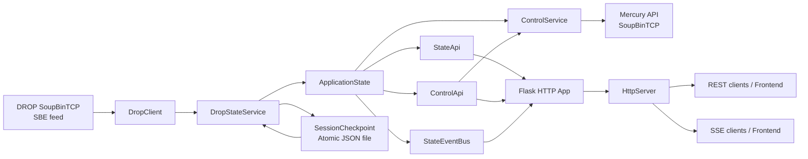
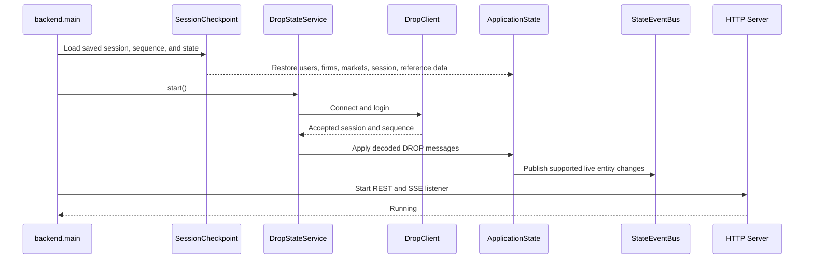
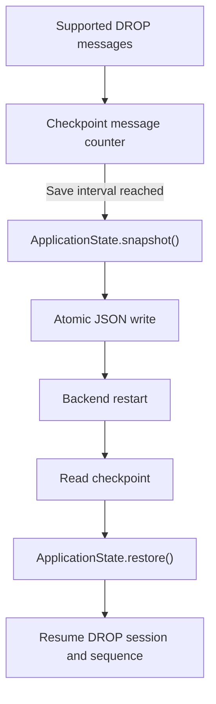
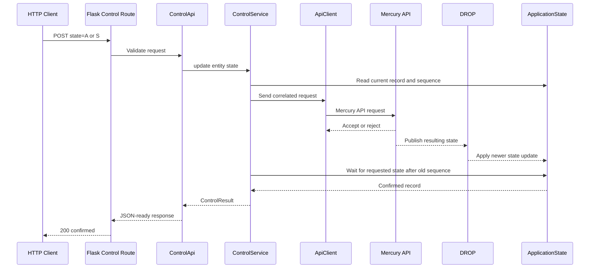
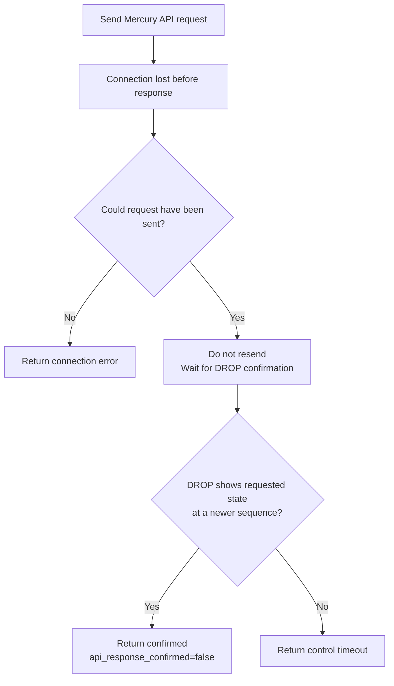
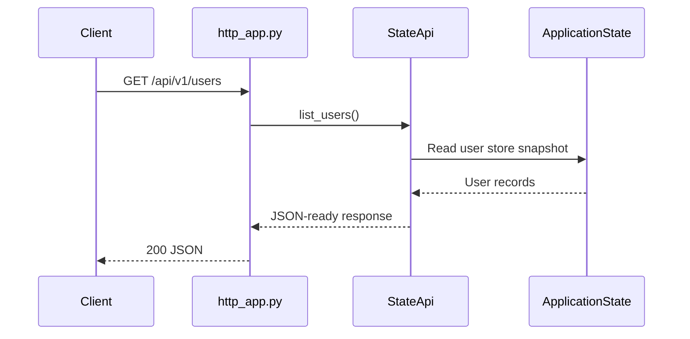
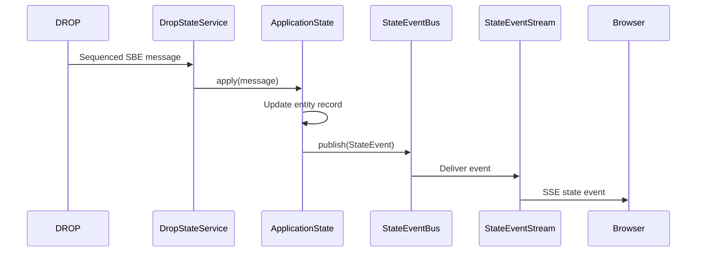
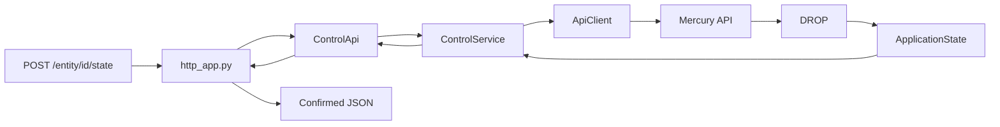

# Market Control Backend Documentation

## 1. Purpose

The Market Control backend is a long-running Python service that:

1. Connects to the DROP SoupBinTCP feed.
2. Decodes supported SBE messages.
3. Builds and maintains the current in-memory state of users, firms, markets, sessions, and reference data.
4. Exposes that state through HTTP REST endpoints.
5. Publishes live state changes through Server-Sent Events (SSE).
6. Sends user, firm, and market suspend/activate commands through the Mercury API.
7. Waits for DROP confirmation before reporting a control request as successful.
8. Saves an atomic checkpoint so the service can recover state and resume from the last Soup sequence after a restart.

The backend is designed around one authoritative in-memory `ApplicationState`.

The checkpoint file is used only for restart recovery. HTTP endpoints and SSE clients read from live memory, not directly from the checkpoint file.

---

## 2. High-Level Architecture



---

## 3. Main Backend Flow



---

## 4. Project Structure

```text
backend/
├── checkpoint/
│   ├── __init__.py
│   ├── session_checkpoint.py
│   └── snapshot_store.py
├── events/
│   ├── __init__.py
│   ├── state_event.py
│   └── state_event_bus.py
├── protocol/
│   ├── api/
│   │   ├── client.py
│   │   ├── message_format.py
│   │   └── messages.py
│   ├── drop/
│   │   ├── client.py
│   │   ├── message_format.py
│   │   └── messages.py
│   ├── soup/
│   │   ├── message_format.py
│   │   ├── messages.py
│   │   └── session.py
│   ├── transport/
│   │   └── socket.py
│   └── errors.py
├── services/
│   ├── control_service.py
│   └── drop_state_service.py
├── specs/
├── state/
│   ├── application_state.py
│   ├── firm_state.py
│   ├── market_state.py
│   ├── reference_state.py
│   ├── session_state.py
│   └── user_state.py
├── web/
│   ├── __init__.py
│   ├── control_api.py
│   ├── http_app.py
│   ├── http_server.py
│   ├── state_api.py
│   └── state_event_stream.py
├── main.py
└── settings.py
```

---

# 5. Component Documentation

## 5.1 `backend/main.py`

### Main role

`backend.main` is the application composition root and process entry point.

It is the component that creates and connects all major backend components.

### Responsibilities

- Parse command-line arguments.
- Configure logging.
- Read credentials and checkpoint settings.
- Create `ApplicationState`.
- Create `DropClient`.
- Create `DropStateService`.
- Create `ApiClient`.
- Create `ControlService`.
- Create `StateApi`.
- Create `ControlApi`.
- Create `StateEventStream`.
- Create the Flask application.
- Start the managed HTTP server.
- Install SIGINT and SIGTERM handlers.
- Monitor the DROP and HTTP services.
- Shut down components in the correct order.
- Save the final checkpoint.

### Startup order

```text
Settings
→ ApplicationState
→ SessionCheckpoint
→ DropClient
→ DropStateService
→ ApiClient
→ ControlService
→ StateApi / ControlApi / StateEventStream
→ Flask application
→ HttpServer
→ Start DROP
→ Start HTTP
```

### Shutdown order

```text
Stop HTTP listener
→ Close Mercury API client
→ Stop DROP service
→ Save final checkpoint
```

Stopping HTTP first prevents new control requests from entering while the API and DROP connections are being closed.

---

## 5.2 `backend/settings.py`

### Main role

Provides environment-based backend configuration.

### Responsibilities

- Read DROP credentials.
- Read Mercury API credentials.
- Read checkpoint location and behavior.
- Convert environment values into the required types.
- Raise a configuration error when a required value is absent or invalid.

### Important environment variables

```text
MARKET_CONTROL_DROP_USERNAME
MARKET_CONTROL_DROP_PASSWORD
MARKET_CONTROL_API_USERNAME
MARKET_CONTROL_API_PASSWORD

MARKET_CONTROL_CHECKPOINT_FILE
MARKET_CONTROL_CHECKPOINT_SAVE_INTERVAL_MESSAGES
MARKET_CONTROL_CHECKPOINT_RESTORE_ENABLED
MARKET_CONTROL_CHECKPOINT_SAVE_ON_SHUTDOWN
```

Fallback credential names may also be supported:

```text
DROP_USERNAME
DROP_PASSWORD
API_USERNAME
API_PASSWORD
```

---

# 6. Protocol Layer

The protocol layer contains low-level networking, SoupBinTCP framing, and message encoding/decoding.

The web layer must not directly read sockets or encode protocol messages.

## 6.1 `backend/protocol/transport/socket.py`

### Main role

Provides the TCP transport used by SoupBinTCP sessions.

### Responsibilities

- Connect to a host and port.
- Send exact byte sequences.
- Receive exact byte counts.
- Apply socket timeouts.
- Close the connection.
- Convert transport failures into backend protocol errors.

### Position in the flow

```text
DropClient or ApiClient
→ SoupSession
→ TcpSocket
→ Network
```

## 6.2 `backend/protocol/soup/message_format.py`

### Main role

Encodes and decodes SoupBinTCP packet framing.

### Responsibilities

- Build SoupBinTCP packets.
- Parse packet length and packet type.
- Validate packet structure.
- Separate Soup headers from application payloads.

## 6.3 `backend/protocol/soup/messages.py`

### Main role

Defines SoupBinTCP message representations and constants.

Typical Soup packet types include:

```text
L  Login request
A  Login accepted
J  Login rejected
S  Sequenced data
U  Unsequenced data
H  Server heartbeat
R  Client heartbeat
Z  End of session
O  Logout request
```

The client heartbeat must use `R`. `H` is sent by the server.

## 6.4 `backend/protocol/soup/session.py`

### Main role

Manages a SoupBinTCP session on top of `TcpSocket`.

### Responsibilities

- Connect and disconnect.
- Login and logout.
- Track the accepted Soup session.
- Track the next Soup sequence.
- Send sequenced or unsequenced application payloads.
- Receive sequenced responses.
- Handle server heartbeat packets.
- Send client heartbeat packets.
- Detect login rejection and end-of-session conditions.

This component knows SoupBinTCP but does not know the business meaning of DROP or Mercury API messages.

## 6.5 `backend/protocol/drop/messages.py`

### Main role

Defines decoded DROP business-message objects.

Examples include:

- User definition
- User status
- Firm definition
- Firm status
- Market definition
- Market trading state
- Market trading phase
- Session and reference messages

The exact classes are consumed by `ApplicationState.apply()`.

## 6.6 `backend/protocol/drop/message_format.py`

### Main role

Decodes SBE payloads received through DROP.

### Responsibilities

- Read the SBE message header.
- Determine the template ID.
- Decode supported templates.
- Build strongly structured DROP message objects.
- Reject malformed payloads.
- Identify unsupported template IDs.

Supported templates currently include:

```text
1, 2, 3, 4, 7, 20, 21, 28, 32, 34, 55, 56
```

Known unsupported templates currently include:

```text
5, 6, 8, 9, 23, 24, 25, 29, 42, 44, 45, 53, 54
```

An unsupported template is logged and skipped. It must not corrupt the reconstructed state.

## 6.7 `backend/protocol/drop/client.py`

### Main role

Provides the DROP-specific SoupBinTCP client.

### Responsibilities

- Connect to the DROP endpoint.
- Login with a requested session and sequence.
- Validate the accepted session and sequence.
- Read Soup packets continuously.
- Respond to server heartbeats.
- Decode sequenced SBE payloads.
- Return decoded DROP message objects.
- Track the next sequence.
- Detect disconnects and protocol errors.

### Important behavior

When resuming from a checkpoint, an exact session and sequence match is required.

If exact resume is rejected or mismatched, `DropStateService` can fall back to a full replay from sequence `1`.

## 6.8 `backend/protocol/api/messages.py`

### Main role

Defines Mercury API request and response message types.

The current control scope includes:

- Update user state
- Update firm state
- Update market state
- Accept response
- Reject response

Control state values:

```text
A = Active
S = Suspended
```

## 6.9 `backend/protocol/api/message_format.py`

### Main role

Encodes Mercury API requests and decodes API responses.

### Responsibilities

- Encode request structures.
- Include a correlation ID.
- Decode accept responses.
- Decode reject responses.
- Convert reject reason codes to readable text.
- Validate message types and required fields.

## 6.10 `backend/protocol/api/client.py`

### Main role

Sends one Mercury API control request and receives its correlated response.

### Responsibilities

- Create a unique correlation ID.
- Connect and login to the Mercury API Soup session.
- Send an unsequenced request.
- Receive a sequenced accept or reject response.
- Verify the response correlation ID.
- Raise a typed error for API rejection.
- Recover a response after a connection loss without resending the request.
- Mark a request as ambiguous when it may have reached the engine.
- Close the API Soup session after each administrative request.

### Why a fresh session is used per request

Administrative controls are low-frequency operations.

Keeping an idle API session open caused the server to close it before a later request. A fresh session per control request avoids stale idle connections and keeps request behavior predictable.

### Safety rule

An ambiguous request is never automatically resent.

The request may already have reached the matching engine. Resending could execute the same control action twice.

Instead, `ControlService` checks DROP for confirmation.

## 6.11 `backend/protocol/errors.py`

### Main role

Defines typed exceptions shared by protocol, service, and web layers.

Examples include:

- Transport errors
- Connection closed
- Soup login rejection
- Soup end of session
- API request rejection
- API connection loss
- Control timeout
- General control error
- Protocol error

Typed exceptions allow the HTTP layer to return meaningful status codes and JSON errors.

---

# 7. State Layer

The state layer is the authoritative in-memory representation of the market-control system.

## 7.1 `backend/state/application_state.py`

### Main role

Acts as the central state container and message dispatcher.

This is the most important state component.

### Responsibilities

- Hold user, firm, market, session, and reference stores.
- Receive decoded DROP messages.
- Route each message to the correct store.
- Suppress stale or duplicate updates.
- Provide thread-safe reads and waits.
- Publish live entity changes to `StateEventBus`.
- Build a complete serializable snapshot.
- Restore a complete snapshot.
- Clear all state when a full replay is required.

### Important rule

Only successfully applied live updates publish events.

Checkpoint restoration does not publish fake live events.

## 7.2 `backend/state/user_state.py`

### Main role

Stores user definitions and administrative user state.

### Typical stored fields

- `user_id`
- `user_index`
- `user_name`
- `firm_id`
- `firm_index`
- `state`
- `capacity`
- `liquidity_provider`
- `allow_override`
- `live_order_limit`
- `user_type_id`
- Definition sequence and timestamp
- State sequence and timestamp
- Last sequence and timestamp

### Main operations

- Apply user definition.
- Apply user status.
- Get one user.
- List users.
- Wait for a user to exist.
- Wait for a user to reach an expected state after a specific sequence.

The state sequence is used to confirm administrative user-control requests.

## 7.3 `backend/state/firm_state.py`

### Main role

Stores firm definitions and administrative firm state.

### Main operations

- Apply firm definition.
- Apply firm status.
- Get one firm.
- List firms.
- Wait for a firm to exist.
- Wait for a firm to reach an expected state after a sequence.

## 7.4 `backend/state/market_state.py`

### Main role

Stores market definitions, administrative market state, and trading phase information.

### Main operations

- Apply market definition.
- Apply market suspend/activate state.
- Apply market trading phase updates.
- Get one market.
- List markets.
- Wait for an expected administrative state.

### Important distinction

Administrative state confirmation must use the market state sequence.

A market definition or trading-phase sequence must not incorrectly confirm a suspend/activate request.

## 7.5 `backend/state/session_state.py`

### Main role

Stores current business-session information reconstructed from DROP.

Possible information includes:

- Trade date
- Session status
- Current Soup session metadata
- Relevant system events

The HTTP endpoint `/api/v1/session` exposes this state.

## 7.6 `backend/state/reference_state.py`

### Main role

Stores reference information required to interpret users, firms, and markets.

Examples may include:

- User types
- User-to-market assignments
- System events
- Other supported definitions

This state contributes to the complete checkpoint snapshot and status counts.

---

# 8. Event Layer

## 8.1 `backend/events/state_event.py`

### Main role

Represents one immutable state-change event.

### Typical event fields

- Event ID
- Event type
- Entity type
- Entity ID
- DROP matching-engine sequence
- DROP timestamp
- Message type
- Current record
- Changed fields

Example:

```json
{
  "event_id": 3,
  "event_type": "updated",
  "entity_type": "user",
  "entity_id": 402,
  "message_type": "UserStatusMessage",
  "sequence": 8768,
  "changed_fields": {
    "state": {
      "old": "A",
      "new": "S"
    }
  }
}
```

## 8.2 `backend/events/state_event_bus.py`

### Main role

Provides thread-safe publication, history, subscriptions, and waits for state events.

### Responsibilities

- Assign monotonically increasing process-local event IDs.
- Keep a bounded event history.
- Publish events to subscribers.
- Allow subscribers to resume after an event ID.
- Detect when a requested event is older than retained history.
- Detect backend restart cursor mismatches.
- Support blocking waits with timeouts.
- Close subscriptions during shutdown.

### Event ID behavior

Event IDs are process-local.

They restart after a backend restart and are not restored from the checkpoint.

The actual DROP sequence remains the authoritative matching-engine sequence.

---

# 9. Checkpoint Layer

## 9.1 `backend/checkpoint/snapshot_store.py`

### Main role

Reads and writes the checkpoint JSON file atomically.

### Responsibilities

- Serialize the checkpoint.
- Write to a temporary file.
- Flush data.
- Replace the current checkpoint atomically.
- Read and validate the current checkpoint.
- Delete an invalid or obsolete checkpoint when required.

Atomic replacement prevents a partially written checkpoint from becoming the active recovery file.

## 9.2 `backend/checkpoint/session_checkpoint.py`

### Main role

Combines Soup resume information with a complete `ApplicationState` snapshot.

### Stored information

- Accepted DROP Soup session.
- Next DROP Soup sequence.
- Trade date.
- Save timestamp.
- Complete application-state snapshot.

### Responsibilities

- Save a checkpoint periodically.
- Save a checkpoint during clean shutdown.
- Load a checkpoint during startup.
- Restore the application state.
- Provide the requested session and sequence to `DropStateService`.
- Report checkpoint errors without silently corrupting runtime state.

### Checkpoint flow



---

# 10. Service Layer

The service layer coordinates protocol clients and application state.

## 10.1 `backend/services/drop_state_service.py`

### Main role

Runs the continuous DROP state-reconstruction lifecycle.

This is the main component responsible for keeping the backend state current.

### Responsibilities

- Start the DROP worker thread.
- Restore a checkpoint before connecting.
- Connect at the restored or configured session and sequence.
- Validate exact resume.
- Fall back to a full replay when exact resume is unavailable.
- Receive decoded DROP messages.
- Apply messages to `ApplicationState`.
- Reconnect after connection loss.
- Track service status and counters.
- Save periodic checkpoints.
- Save a final checkpoint on shutdown.

### Full replay behavior

```text
Checkpoint exact resume accepted
→ Continue from saved sequence

Checkpoint missing or invalid
→ Start from configured sequence, normally 1

Exact resume rejected or mismatched
→ Clear restored state
→ Login for full replay from sequence 1
→ Rebuild complete state
```

## 10.2 `backend/services/control_service.py`

### Main role

Coordinates Mercury API control requests with authoritative DROP confirmation.

This is the main business component for suspend/activate commands.

### Responsibilities

1. Verify that the entity currently exists in DROP state.
2. Record its current administrative state sequence.
3. Send the Mercury API request.
4. Receive API accept/reject when possible.
5. Handle an ambiguous API connection loss safely.
6. Wait for DROP to show the requested state at a newer sequence.
7. Return `ControlResult` only after confirmation.
8. Return the confirmed sequence and state timestamp.

### Control confirmation flow



### Ambiguous API response flow



---

# 11. Web Layer

The web layer exposes backend functionality through REST and SSE.

It does not decode DROP, manage Soup sessions, or directly modify state.

## 11.1 `backend/web/state_api.py`

### Main role

Provides a framework-independent read-only API over `ApplicationState`.

This is the main component that prepares data for the read-only HTTP endpoints.

### Responsibilities

- Build the health response.
- Build service and state status.
- Return session information.
- List users, firms, and markets.
- Return one user, firm, or market.
- Return JSON-ready dictionaries.
- Include the latest event ID.
- Raise a typed not-found error.

### Important separation

`StateApi` does not define Flask routes.

It provides application operations that can be called by Flask or another transport in the future.

## 11.2 `backend/web/control_api.py`

### Main role

Provides a framework-independent web-facing control interface.

### Responsibilities

- Validate entity IDs.
- Normalize state to `A` or `S`.
- Validate timeouts.
- Check whether an entity already has the requested state.
- Avoid unnecessary API calls for idempotent requests.
- Call `ControlService`.
- Convert `ControlResult` into JSON-ready output.
- Map protocol and service errors into web-layer control errors.

### Idempotent behavior

When the entity is already in the requested state:

```json
{
  "status": "unchanged",
  "changed": false,
  "api_response_confirmed": false,
  "confirmed_by_drop": true
}
```

No Mercury API request is sent.

## 11.3 `backend/web/state_event_stream.py`

### Main role

Converts `StateEventBus` events into SSE-formatted messages.

### Responsibilities

- Format live state events.
- Send keep-alive comments.
- Resume after `Last-Event-ID`.
- Detect an event-history gap.
- Detect a browser cursor that is ahead after backend restart.
- Ask the frontend to reload full REST state through a `reset` event.

### Normal SSE event

```text
id: 3
event: state
data: {"entity_type":"user","entity_id":402,...}
```

### Keep-alive

```text
: keep-alive
```

### Reset event

```text
event: reset
data: {"reason":"history_gap",...}
```

After a reset event, the frontend should:

1. Close the current `EventSource`.
2. Reload users, firms, and markets through REST.
3. Open a new SSE connection.

## 11.4 `backend/web/http_app.py`

### Main role

Defines the Flask HTTP application and all API routes.

This is the main component responsible for providing the API endpoints.

### Responsibilities

- Register REST routes.
- Register SSE route.
- Parse JSON control requests.
- Validate HTTP content type and fields.
- Call `StateApi`, `ControlApi`, and `StateEventStream`.
- Convert exceptions into JSON error responses.
- Set cache and security headers.

### Endpoint groups

#### Health and status

```text
GET /health
GET /api/v1/status
GET /api/v1/session
```

#### Users

```text
GET  /api/v1/users
GET  /api/v1/users/<user_id>
POST /api/v1/users/<user_id>/state
```

#### Firms

```text
GET  /api/v1/firms
GET  /api/v1/firms/<firm_id>
POST /api/v1/firms/<firm_id>/state
```

#### Markets

```text
GET  /api/v1/markets
GET  /api/v1/markets/<market_id>
POST /api/v1/markets/<market_id>/state
```

#### Live events

```text
GET /api/v1/events
```

### HTTP error mapping

| Condition | HTTP status | Error code |
|---|---:|---|
| Invalid JSON or request field | 400 | `bad_request` |
| Entity or route not found | 404 | `not_found` |
| Mercury API rejected request | 409 | `control_rejected` |
| Method not allowed | 405 | `method_not_allowed` |
| Control layer failure | 502 | `control_api_error` |
| Control API not configured | 503 | `control_api_unavailable` |
| Event stream not configured | 503 | `event_stream_unavailable` |
| DROP confirmation timeout | 504 | `control_timeout` |

## 11.5 `backend/web/http_server.py`

### Main role

Runs the Flask WSGI application in a managed thread.

### Responsibilities

- Bind the configured HTTP host and port.
- Start the Werkzeug server.
- Expose the bound host and port.
- Report server failures.
- Stop accepting requests during shutdown.
- Join the HTTP thread cleanly.

`http_app.py` defines routes.

`http_server.py` actually listens on the network.

## 11.6 `backend/web/__init__.py`

### Main role

Exports the public web-layer classes and factory functions.

It provides a stable import surface for the rest of the backend.

---

# 12. REST API Reference

## Health

```bash
curl -s http://127.0.0.1:8080/health | jq
```

## List users

```bash
curl -s http://127.0.0.1:8080/api/v1/users | jq
```

Only suspended users:

```bash
curl -s http://127.0.0.1:8080/api/v1/users \
  | jq '.items[] | select(.state == "S")'
```

## Get one user

```bash
curl -s http://127.0.0.1:8080/api/v1/users/402 | jq
```

## Suspend a user

```bash
curl -s \
  -X POST \
  -H 'Content-Type: application/json' \
  -d '{"state":"S","timeout_seconds":10}' \
  http://127.0.0.1:8080/api/v1/users/402/state \
  | jq
```

## Activate a user

```bash
curl -s \
  -X POST \
  -H 'Content-Type: application/json' \
  -d '{"state":"A","timeout_seconds":10}' \
  http://127.0.0.1:8080/api/v1/users/402/state \
  | jq
```

## List firms

```bash
curl -s http://127.0.0.1:8080/api/v1/firms | jq
```

## Get one firm

```bash
curl -s http://127.0.0.1:8080/api/v1/firms/2 | jq
```

## Suspend or activate a firm

```bash
curl -s \
  -X POST \
  -H 'Content-Type: application/json' \
  -d '{"state":"S","timeout_seconds":10}' \
  http://127.0.0.1:8080/api/v1/firms/2/state \
  | jq
```

Change `S` to `A` to activate.

## List markets

```bash
curl -s http://127.0.0.1:8080/api/v1/markets | jq
```

## Get one market

```bash
curl -s http://127.0.0.1:8080/api/v1/markets/16 | jq
```

Use the actual `market_id` returned by the list endpoint.

## Suspend or activate a market

```bash
curl -s \
  -X POST \
  -H 'Content-Type: application/json' \
  -d '{"state":"S","timeout_seconds":10}' \
  http://127.0.0.1:8080/api/v1/markets/16/state \
  | jq
```

Change `S` to `A` to activate.

## Watch live SSE events

```bash
curl -N \
  -H 'Accept: text/event-stream' \
  http://127.0.0.1:8080/api/v1/events
```

---

# 13. Complete Request Flows

## 13.1 Read-only list request



## 13.2 Live state update



## 13.3 Control request



---

# 14. Threading Model

```text
Main thread
- Starts services
- Handles process signals
- Monitors health
- Coordinates shutdown

DROP worker thread
- Reads DROP Soup messages
- Decodes SBE
- Applies state updates
- Publishes events
- Saves periodic checkpoints

HTTP server thread
- Accepts REST and SSE connections

HTTP request worker threads
- Serve read requests
- Execute control requests
- Wait for DROP confirmation

SSE subscribers
- Wait for and stream StateEventBus events
```

Thread safety is required because DROP writes state while HTTP requests read it and control requests wait for updates.

---

# 15. Source of Truth

| Source | Purpose | Authoritative for live UI? |
|---|---|---|
| `ApplicationState` | Current live users, firms, markets, session, references | Yes |
| DROP matching-engine sequence | Ordering and freshness of market state | Yes |
| Checkpoint JSON | Restart and crash recovery | No |
| SSE event ID | Frontend reconnect cursor within one backend process | No, process-local only |

The frontend must use REST and SSE, not read the checkpoint file.

---

# 16. Reliability Rules

## Stale-message suppression

A DROP message with an older or duplicate sequence must not replace a newer state record.

## Exact resume

Checkpoint restore is accepted only when the DROP server accepts the requested session and sequence exactly.

## Full replay fallback

When exact resume cannot be trusted, the backend clears restored state and rebuilds it from a full replay.

## No automatic ambiguous-request resend

When an API response is lost after a request may have been sent, the request is not resent.

DROP confirmation determines whether the state change occurred.

## Confirm through administrative state sequence

A control request is confirmed only by a newer administrative state update.

Definition or trading-phase updates must not act as false confirmation.

## Fresh API connection per administrative request

Each control request uses a fresh API Soup session to avoid stale idle connections.

---

# 17. Operational Commands

## Start the backend

```bash
export MARKET_CONTROL_DROP_USERNAME=drop01
export MARKET_CONTROL_DROP_PASSWORD='...'
export MARKET_CONTROL_API_USERNAME=XBAND1
export MARKET_CONTROL_API_PASSWORD='...'
export MARKET_CONTROL_CHECKPOINT_FILE=/tmp/market-control-current_session.json

python3 -m backend.main \
  -H xnt-dde1api01n \
  -p 12001 \
  --api-port 11005 \
  --http-host 127.0.0.1 \
  --http-port 8080
```

## Check health

```bash
curl -s http://127.0.0.1:8080/health | jq
```

## Stop

Press `Ctrl-C`.

The backend stops HTTP first, closes the API client, stops DROP, and saves the final checkpoint.

---

# 18. Testing Overview

Important tests include:

```text
test_state_event.py
test_state_event_bus.py
test_application_state_events.py
test_application_state_restore.py
test_live_drop_state_events.py
test_state_api.py
test_http_app.py
test_http_server.py
test_state_event_stream.py
test_http_sse.py
test_control_api.py
test_http_control.py
test_control_service.py
```

| Area | What is verified |
|---|---|
| State | Apply, restore, stale-update suppression |
| Events | Publication, subscriptions, history gaps |
| DROP | Replay, reconnect, live updates |
| Checkpoint | Atomic save, restore, corruption fallback |
| REST | Routes, status codes, JSON responses |
| SSE | Live events, keep-alive, reconnect, reset |
| Control | API request, DROP confirmation, ambiguity |
| HTTP server | Real listener startup and shutdown |

---

# 19. Current Completion Status

## Completed

- DROP SoupBinTCP connectivity
- SBE decoding for supported templates
- User state reconstruction
- Firm state reconstruction
- Market state reconstruction
- Session and reference state
- Thread-safe in-memory state
- Checkpoint save and restore
- Exact resume and full-replay fallback
- REST read endpoints
- SSE live updates
- User suspend and activate
- Firm suspend and activate
- Market suspend and activate
- Mercury API reject handling
- Ambiguous API response protection
- DROP confirmation
- Confirmed sequence and timestamp
- Managed HTTP startup and shutdown

## Separate production layers still to add

- Keycloak authentication
- Role-based authorization
- Audit logging
- Request identity and operator information
- Kubernetes manifests or Helm integration
- Frontend UI
- Metrics and monitoring
- Rate limiting
- TLS and ingress configuration

These are production and presentation layers. The core backend behavior for user, firm, and market monitoring and control is implemented.

---

# 20. Component Responsibility Summary

| Component | Main purpose |
|---|---|
| `main.py` | Creates, starts, monitors, and stops the complete backend |
| `settings.py` | Reads environment-based configuration |
| `TcpSocket` | TCP transport |
| `SoupSession` | SoupBinTCP login, packet flow, heartbeat, sequence |
| `DropClient` | Receives and decodes DROP messages |
| `ApiClient` | Sends correlated Mercury API control requests |
| `DropStateService` | Maintains the continuous DROP lifecycle |
| `ControlService` | Sends control and waits for DROP confirmation |
| `ApplicationState` | Authoritative live in-memory state |
| User/Firm/Market stores | Entity-specific records and waits |
| `StateEventBus` | Publishes and retains live state events |
| `SessionCheckpoint` | Saves/restores session, sequence, and state |
| `StateApi` | Prepares read-only API data |
| `ControlApi` | Validates and prepares control operations |
| `StateEventStream` | Converts live events into SSE |
| `http_app.py` | Defines REST/SSE routes and HTTP error mapping |
| `http_server.py` | Runs the real HTTP listener |

---

# 21. Simplified Mental Model

```text
DROP tells the backend what the current world looks like.

ApplicationState remembers that world in memory.

StateApi lets clients read it.

StateEventBus and SSE tell clients when it changes.

ControlApi accepts a requested change.

ControlService sends that change through Mercury API.

DROP must confirm the change before the backend reports success.

SessionCheckpoint helps the backend recover after restart.
```
